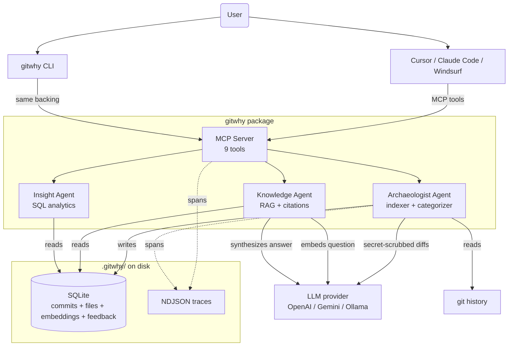
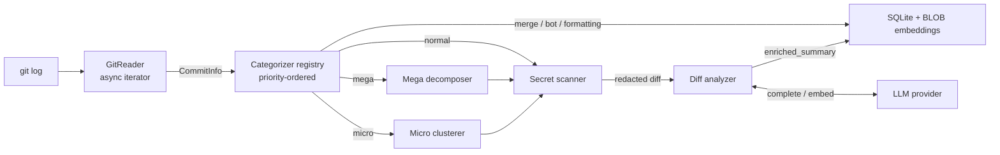

# GitWhy — Architecture Blueprint

**Status:** Capstone v1
**License:** MIT
**Repository:** [github.com/kamsqe/gitwhy](https://github.com/kamsqe/gitwhy)

---

## 1. Problem statement

Developers waste hours understanding unfamiliar code. The answers usually live in git history, but commit messages are often useless ("fix", "wip", "major update") and re-discovering the *why* requires re-reading diffs that nobody else has time for.

AI coding agents (Cursor, Claude Code, Windsurf) partially solve this for the active editor session — they can call `git log -p` and reason over diffs — but their context is ephemeral. Every new session re-pays the same analysis cost, the cost is paid in scarce LLM context tokens, and the results aren't shared with teammates.

**GitWhy is the persistent memory layer those agents are missing.** It indexes a repository's history once, enriches every commit with an AI-inferred summary, and exposes the result over MCP so any compatible editor can answer "why does this exist?" instantly and with citations.

---

## 2. High-level architecture



The MCP server is the **primary** surface: the editor calls a tool, GitWhy returns a citation-backed answer in milliseconds (no re-analysis at query time). The CLI shares every backing component and exists as a fallback for users without an MCP-capable editor and for capstone reviewers.

---

## 3. The three agents

The capstone rubric requires multi-agent inter-agent communication. GitWhy has three agents with **genuinely distinct responsibilities and different LLM usage patterns** — the cheap quick-test is "would I run them on different machines?" Yes.

```mermaid
sequenceDiagram
  participant U as User / Cursor
  participant M as MCP Server
  participant A as Archaeologist
  participant K as Knowledge
  participant I as Insight
  participant DB as SQLite

  Note over A: At index time (once per repo, resumable)
  A->>A: Read git history, categorize each commit
  A->>A: Cluster micro-commits; decompose mega-commits
  A->>A: Secret-scan diff, send to LLM, generate summary
  A->>DB: Write enriched_summary + embedding

  Note over U,M: At query time (per-message)
  U->>M: gitwhy.why("why does X exist?")
  M->>K: ask(question)
  K->>K: Embed question
  K->>DB: Vector search top-K
  K->>K: Synthesize answer with citations
  K-->>M: { answer, citations, confidence }
  M-->>U: Citation-backed answer

  Note over U,M: At edit time
  U->>M: gitwhy.risk(path)
  M->>I: riskScore(path) (pure SQL)
  I->>DB: SELECT contributors, churn, ghost
  I-->>M: { level, reasons, contributors }
  M-->>U: Risk assessment
```

### 3.1 Archaeologist — the core innovation

The agent that earns GitWhy its name. For each commit it:

1. **Categorizes** by metadata only: merge, initial, bot, revert, then size-based (micro / normal / mega). This is fast pure SQL/regex; no LLM.
2. **Clusters** consecutive micro-commits by the same author within a 60-minute gap into logical units, so 8 "wip" commits become 1 enrichment call.
3. **Decomposes** mega-commits (>500 line diffs) into per-module groups (top-2 path segments), enriching each group independently to keep per-call token counts bounded.
4. **Pre-scrubs diffs for secrets** (AWS / GitHub / OpenAI / JWT / PEM / 12 patterns total) before any cloud LLM call.
5. **Asks the LLM** for one concise sentence per commit/group, with a system prompt that explicitly tells the model to ignore instructions inside commit content (prompt-injection mitigation).
6. **Generates an embedding** of the enriched summary and stores it as a SQLite BLOB.

Output: an enriched, semantically searchable record of the repository's reasoning.

### 3.2 Knowledge — the conversational surface

Powers `gitwhy.why`, `gitwhy.history`, `gitwhy.search`, `gitwhy.catchup`, and the `gitwhy why` CLI. Per query:

1. Embed the user's question with the same model used at index time.
2. Cosine-similarity search across stored embeddings (JS-side; sub-200ms at 50k commits).
3. If top-1 score < 0.4 (configurable threshold) → return "I don't have enough information" **without** burning a completion call. Confidence is real and gated.
4. Otherwise, load the top-K commit metadata and synthesize an answer with a system prompt that requires inline citations like `[abc1234]`.
5. Detect hedging in the answer ("not enough information") and lower the reported confidence accordingly.
6. Cache by lowercased question key (LRU, default size 64). Identical questions are free.

### 3.3 Insight — SQL analytics

Powers `gitwhy.risk`, `gitwhy.related`, `gitwhy.context_for_pr`, and the matching CLI commands. **No LLM** — pure SQL over the existing tables.

- **Bus factor:** rank contributors by line-share, find the minimum N whose combined share exceeds 50%.
- **Hotspots:** `recent_commits × total_commits`, excluding merge / bot / formatting / binary.
- **Ghost code:** files whose dominant contributor (≥80% share) has been inactive past a threshold (default 180 days). Bus-factor-zero risks.
- **Co-change:** pairs of files in the same commit, scored by forward confidence and a Jaccard-like correlation.
- **Risk score:** weighted composite (40% bus factor, 30% ghost, 30% hotspot) → LOW / MEDIUM / HIGH with human-readable reasons.

### 3.4 Inter-agent communication

| From | To | Channel |
|---|---|---|
| Archaeologist | Knowledge | Writes enriched_summary + embedding to SQLite; Knowledge reads via VectorStore.query(). |
| Archaeologist | Insight | Writes commits + commit_files; Insight reads via SQL queries — no LLM needed. |
| Insight | Knowledge | Risk + hotspot results are surfaced in MCP-tool responses that Knowledge-authored answers cite alongside. |
| All | MCP layer | Tools register a registry-pattern interface; the server dispatches by name. |

The communication channel is **explicit and persistent** (the SQLite database), not message-passing through memory. This is a deliberate choice: an indexing process that crashes loses nothing; a teammate who runs `gitwhy init` on a different machine sees the same data; the inter-agent contract is the schema, which is testable.

---

## 4. The MCP tool surface

The product, as seen by an AI agent. Tool descriptions are intentionally verbose with example questions baked in — they're load-bearing for agent auto-invocation.

| Tool | When the agent should call it | Backed by |
|---|---|---|
| `gitwhy.why` | User asks "why does X exist?", "why was Y changed?" | Knowledge |
| `gitwhy.history` | User wants the timeline of a file or module | Insight (SQL) |
| `gitwhy.risk` | Before suggesting edits / during PR review | Insight |
| `gitwhy.related` | User is about to edit a file | Insight |
| `gitwhy.context_for_pr` | User is reviewing a PR | Insight + simple-git |
| `gitwhy.catchup` | "What happened while I was away?" | SQL filter by date |
| `gitwhy.suggest_commit_message` | User has staged changes, asks for a message | Archaeologist (live) |
| `gitwhy.search` | Generic fallback / "find commits matching X" | Vector search |
| `gitwhy.ping` | Health-check / debugging | (none) |

`gitwhy mcp-doctor` is the diagnostic command that verifies all tools register with descriptions long enough (≥120 chars) to drive auto-invocation.

---

## 5. Tech stack and rationale

| Component | Tech | Why |
|---|---|---|
| Language | TypeScript (strict, ESM) | Author's primary expertise. Strong type system catches schema/interface drift early. ESM is the modern Node baseline; the MCP SDK is ESM-only. |
| Runtime | Node 20+ | Native `.env` loading via `process.loadEnvFile()`. Mature ecosystem for git tooling (simple-git). |
| LLM (cloud) | OpenAI `gpt-4o-mini` / `gpt-4o`; Google `gemini-2.5-flash` | Both abstracted behind `LlmProvider`. Gemini added explicitly for free-tier users — the LLM provider seam was designed in Phase 1 precisely to make this swap trivial. |
| LLM (local) | Ollama (planned) | Air-gapped privacy mode. Interface already supports it; implementation deferred to post-launch. |
| Vector store | SQLite BLOB + JS cosine similarity | See §6 ("Framework choice defense") for the deliberate rejection of sqlite-vec. |
| Metadata DB | SQLite via better-sqlite3 | Embedded, no server, FK constraints + transactions. The same file holds commits, embeddings, llm_calls (cost accounting), feedback. |
| Git | simple-git | Maintained, full git CLI surface, handles edge cases (renames, binary, shallow). |
| CLI | Commander.js | Standard. Verbose option-parsing handled cleanly. |
| MCP server | `@modelcontextprotocol/sdk` v1.x | Official SDK. Low-level `Server` API for stability; manual zod-to-json-schema conversion at the boundary. |
| Test runner | Vitest 3 | Fast, TS-native, parallel by default. |
| Public site | Astro 5 + Starlight | Static HTML output. Three of seven capstone deliverables (this blueprint, the exec summary, the self-review) render as polished pages without a separate doc system. |
| CI / hosting | GitHub Actions + GitHub Pages | Free, no third-party dependencies for the OSS demo. |

---

## 6. Framework choice defense

The plan's strongest non-obvious decision: **GitWhy does not use a multi-agent orchestration framework like LangGraph, AutoGen, or CrewAI.**

### Why not LangGraph

LangGraph excels at graph-defined agent control flow — explicit state machines, conditional edges, persisted state. Two reasons GitWhy doesn't need it:

1. **Our agent topology is shaped by indexing, not by runtime conversation.** The Archaeologist does its work *once* per commit, asynchronously, in batches. Knowledge and Insight serve queries individually. There's no multi-turn negotiation between agents; the communication channel is the SQLite database. A graph framework would be a hammer with no nail.
2. **MCP is the orchestration layer.** When Cursor calls `gitwhy.why`, the request is routed by the MCP server to Knowledge. When the same Cursor session also calls `gitwhy.risk`, it routes to Insight. The graph is implicit in tool selection by the upstream agent (Cursor) — and Cursor already does this expertly. Building another layer of graph orchestration *inside* GitWhy would duplicate that work and lock the project into Python (LangGraph) or a heavyweight TS framework.

### Why not AutoGen / CrewAI

Both excel at *role-play multi-agent collaboration* — architect agent debates with analyst agent, etc. GitWhy's agents aren't role-playing; they have distinct *tasks* that compose. A discussion between Archaeologist and Knowledge would produce zero new information that isn't already in the SQLite schema.

### What we did instead

The plugin-seam architecture (described in §7) — small typed interfaces (`LlmProvider`, `VectorStore`, `Categorizer`, `McpTool`) with registry patterns. Adding a new LLM provider was a focused PR against one file when we needed Gemini support; a graph framework wouldn't have made it any easier.

**Trade-off acknowledged:** if GitWhy later needs runtime agent-to-agent conversation (e.g., a "code reviewer agent" that consults Insight, then queries Knowledge, then asks the user a follow-up), a graph framework would become attractive. The agents are designed to be callable as building blocks, so the migration would be additive, not a rewrite.

---

## 7. Plugin seams (extensibility)

Every cross-cutting boundary is a small typed interface with a registry-pattern entry point. This is the load-bearing claim for "open-source friendliness" — adding a new commit categorizer or LLM provider is a focused PR against one file, not a refactor.

| Interface | Purpose | First-party implementations | Adding another |
|---|---|---|---|
| `LlmProvider` | `complete()` + `embed()` | `openai`, `gemini`, `mock` | New file in `src/providers/llm/`; register via `registerLlmProvider()` |
| `VectorStore` | `upsert / query / count / delete` | `sqlite-blob` | New file in `src/providers/vector/`; swap by config |
| `Categorizer` | Pure `(commit) → category \| null` | `merge`, `initial`, `bot`, `revert`, `size` | New file in `src/indexer/categorizers/`; register with priority |
| `McpTool` | `{ name, description, schema, handler }` | 9 tools across `src/mcp/tools/` | New file in `src/mcp/tools/`; one-line registration in `tools/index.ts` |

`CONTRIBUTING.md` (planned for OSS launch) will list ~10 good-first-issue stubs along these seams.

---

## 8. Data flow at a glance



---

## 9. Storage layout

```
.gitwhy/
├── config.json                 # provider, scope, budget, paths
├── index/
│   └── commits.sqlite          # commits + commit_files + commit_clusters +
│                               # commit_embeddings + cluster_embeddings +
│                               # llm_calls + query_feedback + schema_meta
├── traces/
│   └── <session>.ndjson        # optional, when GITWHY_TRACE=1
└── (cache/ reserved for future use)
```

The `.gitwhy/` directory is gitignored by default but **committable** — a team can commit the index so new hires get a pre-warmed memory layer without re-paying the indexing cost. This is GitWhy's long-term moat against ephemeral AI agents: the *team* shares institutional memory, not just each developer's editor session.

---

## 10. Quality contract (testing strategy)

| Category | Coverage |
|---|---|
| **Positive** | Categorizers (priority ordering, each rule), diff analyzer (mock LLM round trip), indexer (3-commit temp repo end-to-end), Knowledge (retrieval, citations, caching), Insight (bus factor / hotspots / ghost code / co-change math), all 9 MCP tools |
| **Negative** | Empty repo, binary-only repo, shallow clone, no API key, missing `.gitwhy/`, query against empty index, unknown file path, budget cap reached, stale index |
| **Adversarial** | Prompt injection in commit message and diff body; secrets in diff (AWS / GitHub / OpenAI / JWT / PEM / generic); 100k-char diffs; malformed git output; unicode hazards (zero-width, RTL, control chars, emoji, mixed scripts); SQL-injection-shaped paths; 10 concurrent Knowledge queries; invalid MCP tool input |
| **MCP-specific** | Tool descriptions ≥120 chars (auto-invocation heuristic); tool registration uniqueness; CallToolResult shape conforming to SDK v1.29; runtime tracing spans for every tool call |

**280+ tests across 33 files.** CI matrix runs on Node 20 and 22.

---

## 11. Non-functional requirements

| | Implementation |
|---|---|
| **Observability** | LLM call accounting in `llm_calls` table (count + tokens + cost per call), `gitwhy status` aggregates and reports. NDJSON tracing via `GITWHY_TRACE=1` writes a span per MCP tool call. |
| **Security** | Secret scanner runs *before* any cloud LLM call; 12 patterns including AWS, GitHub, OpenAI/Anthropic keys, JWTs, PEM blocks. `Ollama` provider planned for air-gapped use. |
| **RAG quality** | Confidence scoring with a hard "I don't know" threshold below 0.4 cosine. LLM hedge phrases ("not enough information") trip the same threshold post-synthesis. Every answer has citations. |
| **Cost management** | `gitwhy estimate` does a dry-run cost projection before spending a dollar. `--budget` flag halts indexing mid-stream when cumulative cost crosses the threshold. Rate-limit-aware retry + per-provider pacer for Gemini free tier. |
| **Local-first** | SQLite + JS-side vector search + optional Ollama means GitWhy can run fully offline. No data leaves the machine unless the user wires up a cloud LLM. |
| **Test isolation** | Mock LLM provider is deterministic; every test uses a fresh in-memory SQLite. No flaky network in CI. |

---

## 12. Known limitations and future work

These are documented honestly so contributors know what's intentional and what's deferred. See `docs/self-review.md` for the full trade-off discussion.

- **Risk-score weights are unvalidated.** The 40/30/30 split is intuition, not calibrated against ground-truth bug data.
- **Gemini free-tier mega-commit decomposition** can exceed RPM during heavy bursts despite the pacer. Workarounds: paid tier, smaller commits, or reduce decomposition depth.
- **Indexer is not yet wired into tracing.** Phase 5 wired the MCP server only; the indexer is a follow-up.
- **No live MCP transcript fixtures.** `mcp-doctor` proves descriptions exist; only manual Cursor/Claude Code testing proves they auto-invoke.
- **Cluster enrichment is metadata-only.** Clusters are stored, but no LLM call synthesizes their aggregate diff yet.
